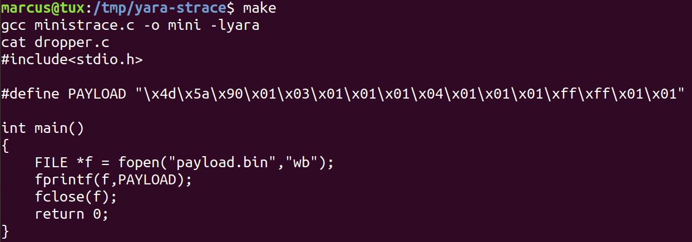
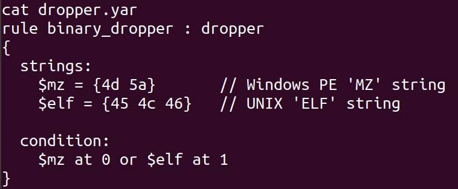
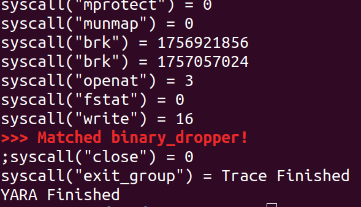

# Real.Time.AV

Additional Material for the Real Time AV paper: Proof of Concept (PoC) of the idea of applying YARA rules to strace arguments.

Run *make* to get the following outcome:

* A simulation of a dropper malware behavior.

* A Heuristic that identifies executable files dropped into the disk.

* Runtime Detection.

